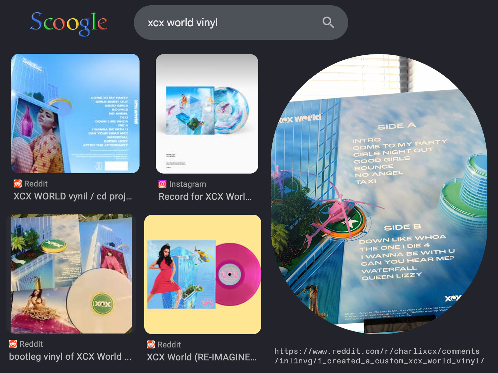

# Background

When Charli XCX's brat came out, I enjoyed it more than I usually enjoy most music. It was a genre I had so obviously seen my entire life, but never actually listened to. It let me connect closer to my more true self, which I hadn't done well due to having such a big taste in genres that didn't exactly respect my life. 

So, I say all this because when I find out about her unreleased album XCX World, it was like opening the door to a world that I never thought I would see. It was gay, happy, and beautiful. A true showcase of what pop could actually be, and interesting genre with so much fluidity. That's why I made this. From the second I heard this album, I knew I needed it physically.

# Process

The first step to making this was seeing others attempt a such a task, and well, there were problems.

Everyones take on this concept is beautiful in their own ways, but for my purpose, it just wasn't what I was looking for. What I was seeing was completely incorrect track lists, *interestingly* picked imagery, or just general signs of bootleg quality. At that moment, I knew exactly what I wanted to create: I wanted to see what it would have looked like if this album actually came out.  
  
To do this, I bought and analyzed a few of her physical vinyls that were either around at this time or came from albums made from this time. The most influential on my design choices was Pop 2's physical release. While it did come out later than the original album, by about 6, it stood as a great reference towards what a modern day release could look like for an album around this time.

# (POP 2 IMAGE !)

Some of the things I noticed from Pop 2's vinyl release was a consistent use of sans-serif typefaces that weren't too special. Think  Helvetica-esque typefaces, no crazy style or look, just clean. I also noticed a overall minimal and simplistic style across the record, that still kept character.   
  
To follow these cues, I found the [photography from bradley & pablo](https://xcx-world.fandom.com/wiki/Template:XCX_World_Photoshoot) for this album, and layered the text on in the same format that her other physical releases had. Some of the challenges I faced while doing this was just making sure the text was visible while still cleanly laying on top of the design. All of this was going to be printed in some sort of CMYK color method, so having small differences between text and background was interesting, but layering it on top with a very slight darkening brush in photoshop allowed me to get that studio look.

Along with text visibility, general layout and positioning of the elments for this back side was almost impossible to get right, but in the end I was able to get it square on just with time.

# (ALBUM IMAGE !)

Finally, to get all of this made physically, I had to jump around to a few places to get my final product. First was getting the actual vinyl, which took a few emails and looking around, but funny enough I actually found a place in London of all places that was willing to lathe this one-off. All of that is ironic to me as I could barely find an American company that was willing to risk copyright in the name of this, but a company in Charli XCX's home country was just happy to. Hallarioius.

For the physical gatefold jacket, there were a few options, but I opted for going with a wedding vinyl company to print it for me. Next time I want to try printing it at a local print shop as the quality was okay but could have been better. I also want to try seeing if any of this type of printing is possible through DIY means, but that's a fun challenge for another day.

# Reflection

So with all of this said and done, did I achieve my goal? Well that is a subjective question up to the reader, fan, or listener. But in my opinion, yes. While I didn't include a poster, any sort of download code, or anything that would have truly set the mark for this being past bootleg status, I made a damn good design, and if anything, I even put a barcode. But all of this is subjective, and the most real part was the process of making it. The love of design. And the drive to create. That's what I call real.

