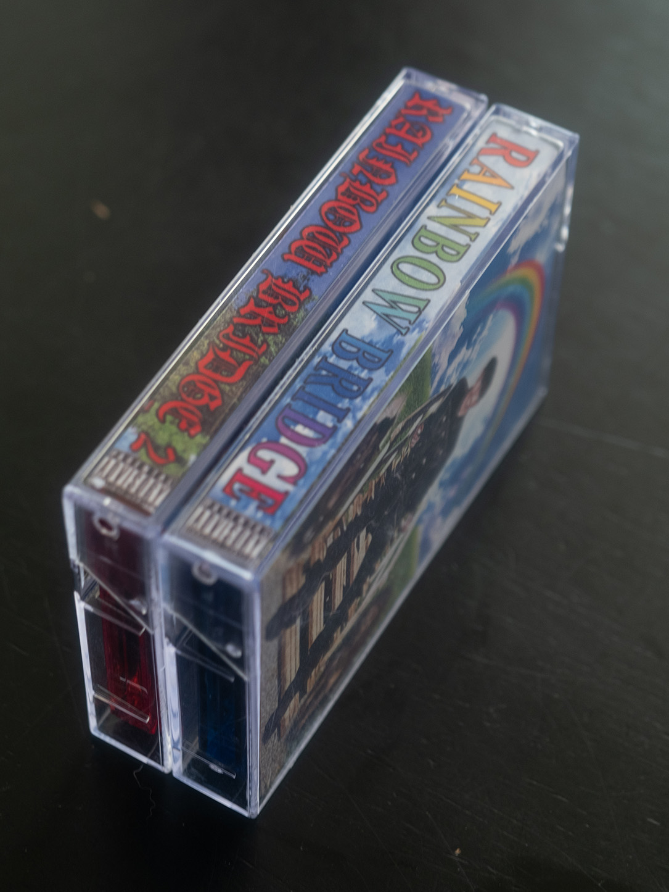
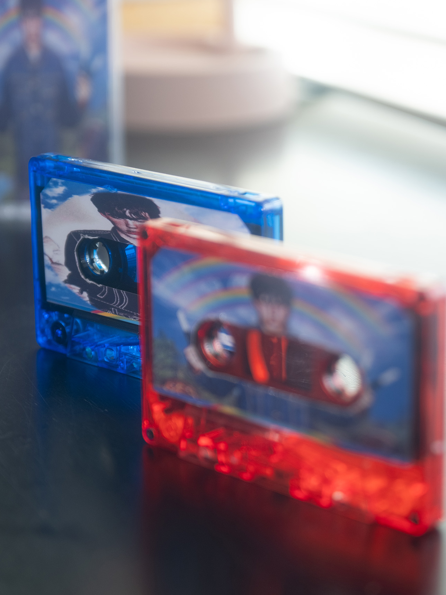
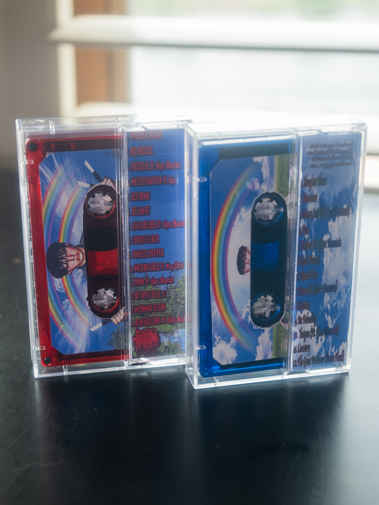
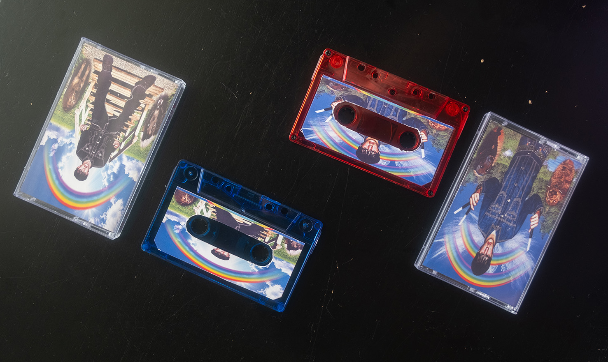

# Introduction

My friend loves the artist Sematary. One day, I was bored and saw that his birthday was coming up, so I decided I was going to remake his favorite album on cassette, Rainbow Bridge 2. The duplication of this album on it's rare format of cassette (originally only having 20 official copies made from the artist) led me to also remaking both this and the first album on cassette, which was interesting as the first album had never been translated to the cassette format before then.

# Process

I'm going to focus on Rainbow Bridge 1 as that's the more original piece, and then I'll talk about matching up the 2 to feel like they were both made by the same person.

For the first album, I started by getting 2 strong references and throwing them in photoshop: Rainbow Bridge 2's physical cassette J-Card for the positioning of certain elements, as well as the [CD art spread for Rainbow Bridge 1](https://www.discogs.com/release/16152566-Sematary-Grave-Man-Rainbow-Bridge-1/image/SW1hZ2U6NTI0OTc3MDg=) which I used entirely for the design of the cassette.

Using the CD art, I fit the tracklist, the cover, and the general elements back into the cassette format as the 2nd album officially did. Honestly this wasn't the hardest remake/reformatting. The hardest part was just just finding the right cassettes and price, which all came from duplication.com.

One of the funnier things I did was manually cutting out the cassette labels by hand and gluing them on. I could have gotten a pre-cut printable template off of amazon or something, but it was more fun anyways to try to precisely cut it out.

Through this I was able to make a very simple yet effective design that looked exactly like it fit into the Rainbow Bridge 2 cassette style. It had the right positioning, the right look, and I even found a descent font for the side of the cassette. Overall success!   
(P.S. my friend liked the cassettes lol :P)

# Reflection

This project was simpler. It was less involved than some of my other works. But it was a great experience seeing how the provided digital imagery could be stitched together to fit another similar format. Like how I used the CD imagery for RB1 to make the cassette version.

