I've always had a thing for the night. I don't know if it's because I was born a 6 PM, or just because my Mom got me to like it, but there's always been something pulling me towards it. It's such a mysterious yet enlightening time. And in recent times, I've been enthrolled by the glow neon and flourescent lights, ambiently providing artificial sunlight to the city.

[ Insert agora cafe houston drawing ]

That's why I started taking these photos, or atleast that's what I like to think. In reality this all started when I got a Minolta X700 for $27 dollars. Usually these cameras go for $80, or even $100, but $27 was a total steal. It was listed as broken and I even got capacitors to potentially fix it but the funniest part of this was the fact it actually worked. All of these early works were taken on the beautiful 28mm lens that came with it. It was great to break the mold by taking a lens wider than the "standard" of these old beautiful cameras: 50mm.

But it wasn't just the camera that got me here. It was Cinestill. As evil as the company is behind this not-so-beautifully over priced rebrand of Kodak's Vision 500T, this film has yielded the absolute best blue tones out of any other film I've ever shot. This is why I kept doing what I do.

# Dallas

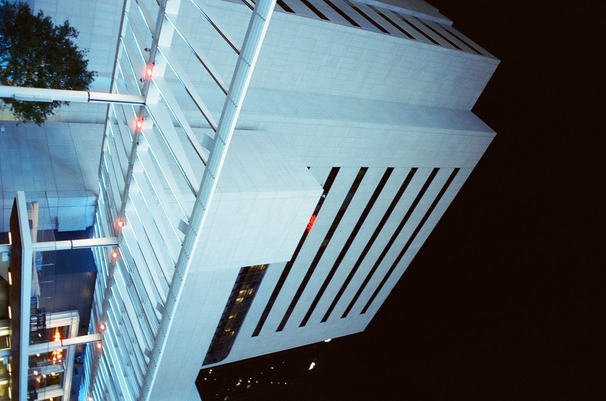

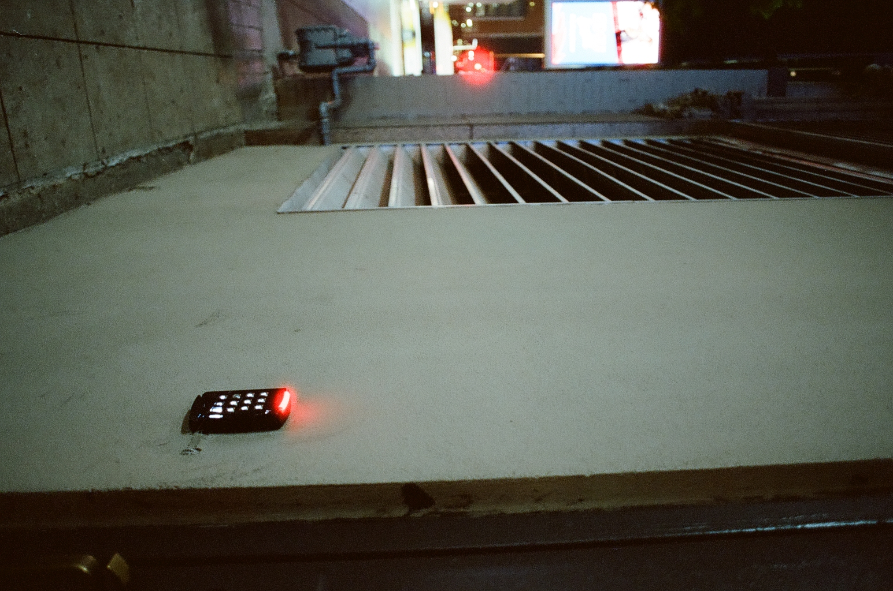

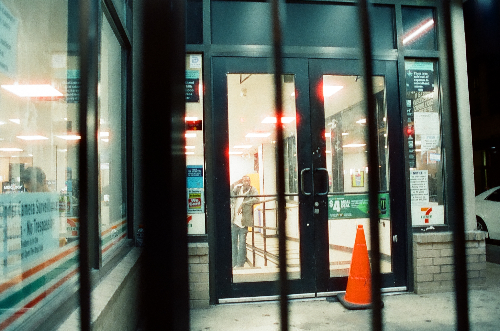

# Seattle

### 2025

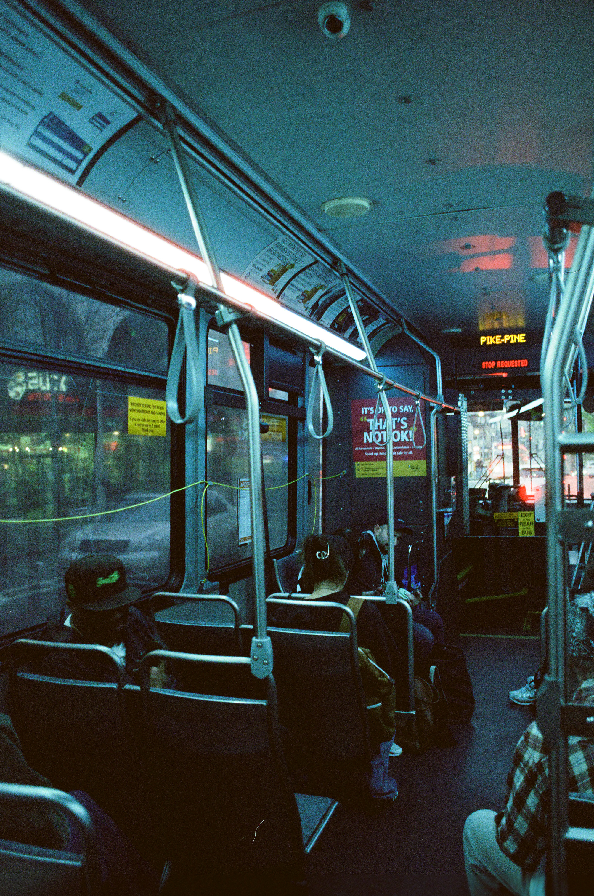

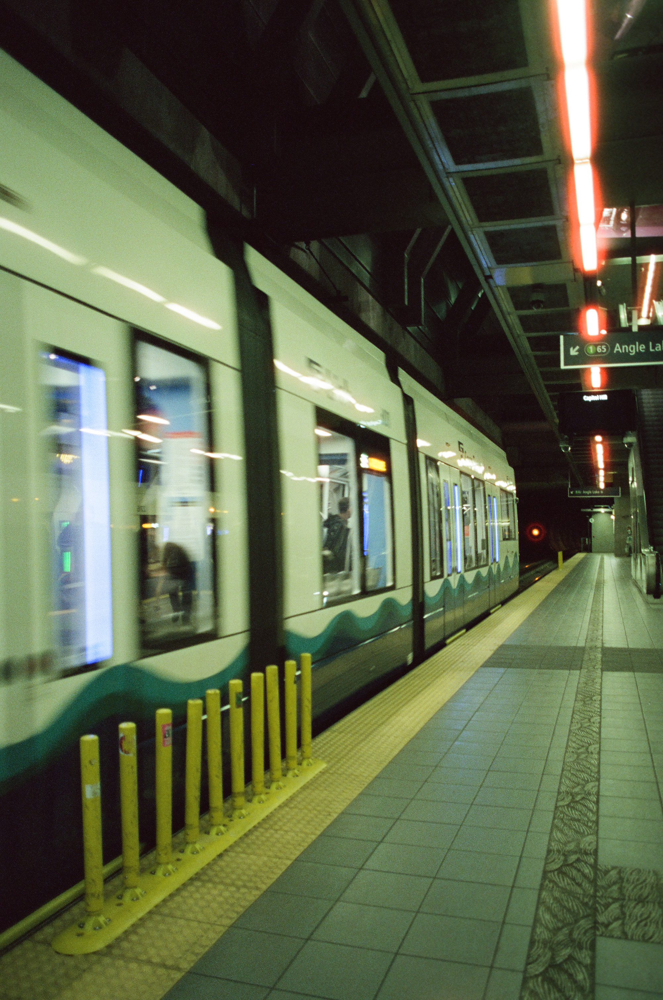

### 2026

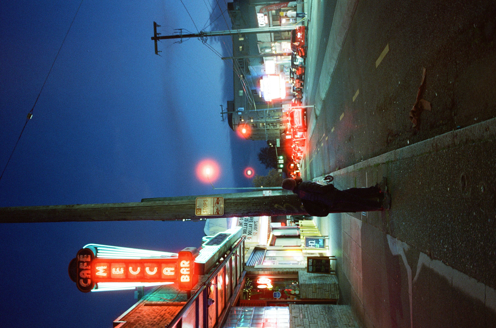

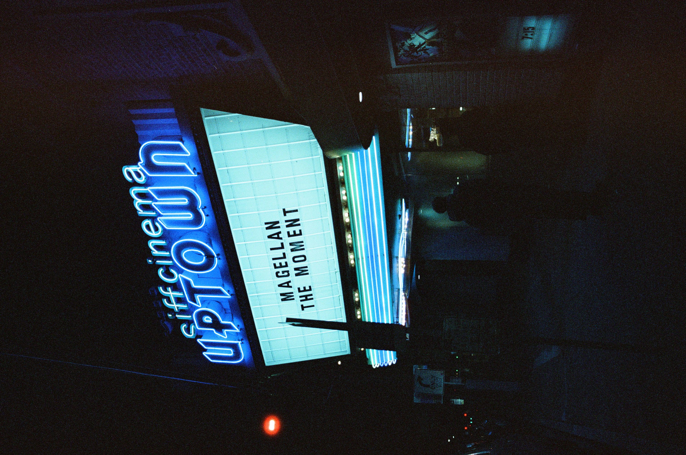

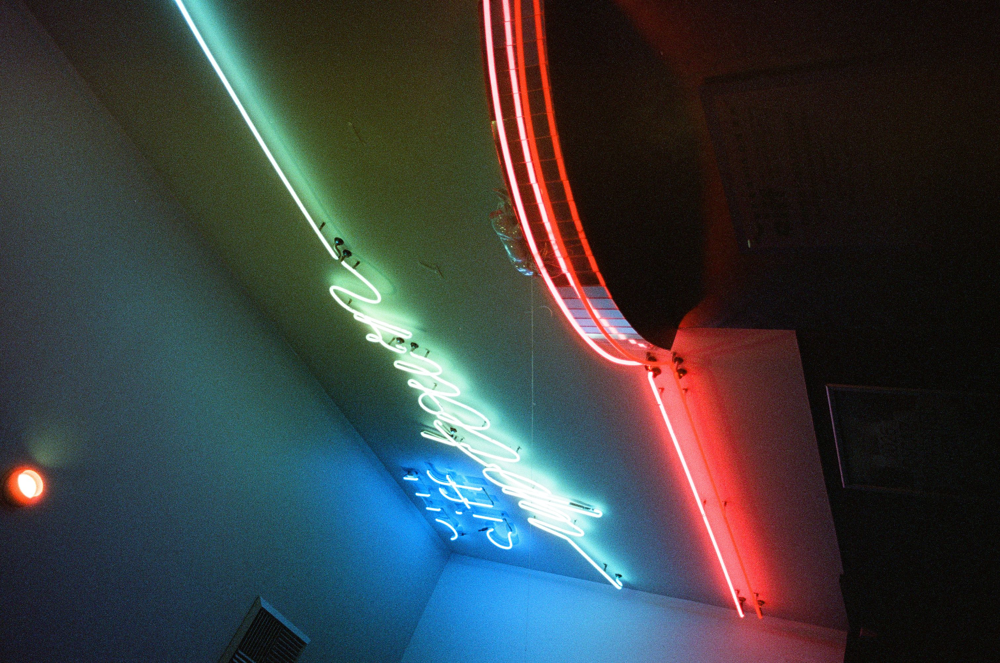

# New York

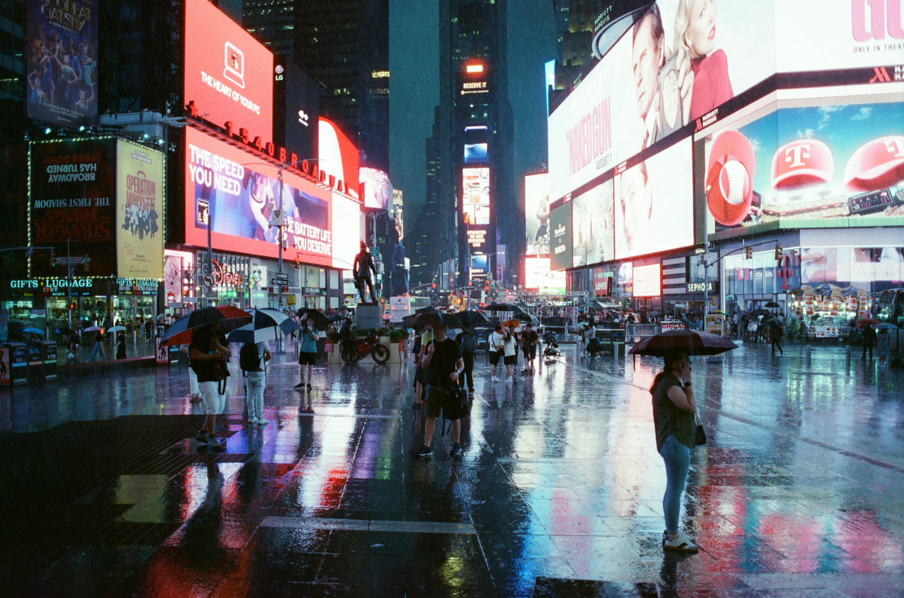

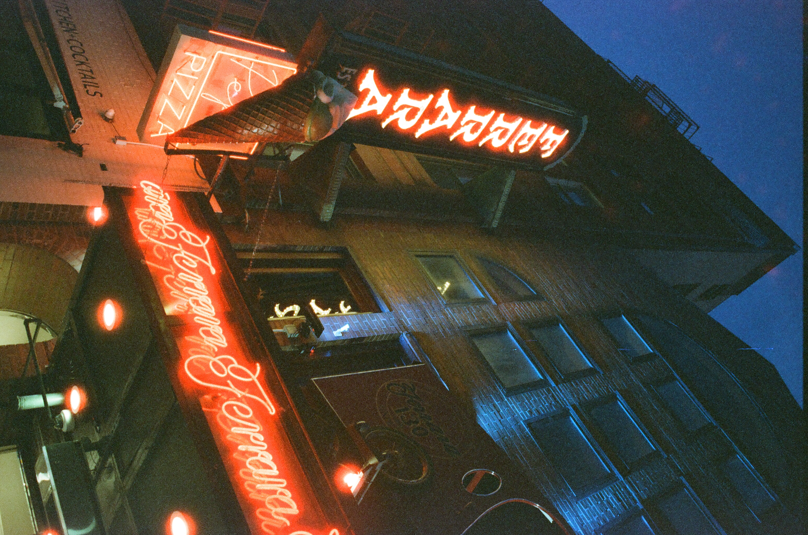

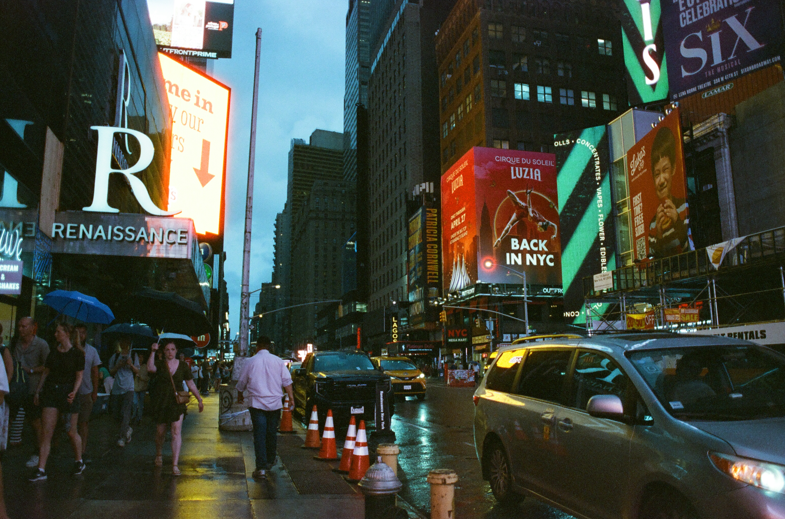

