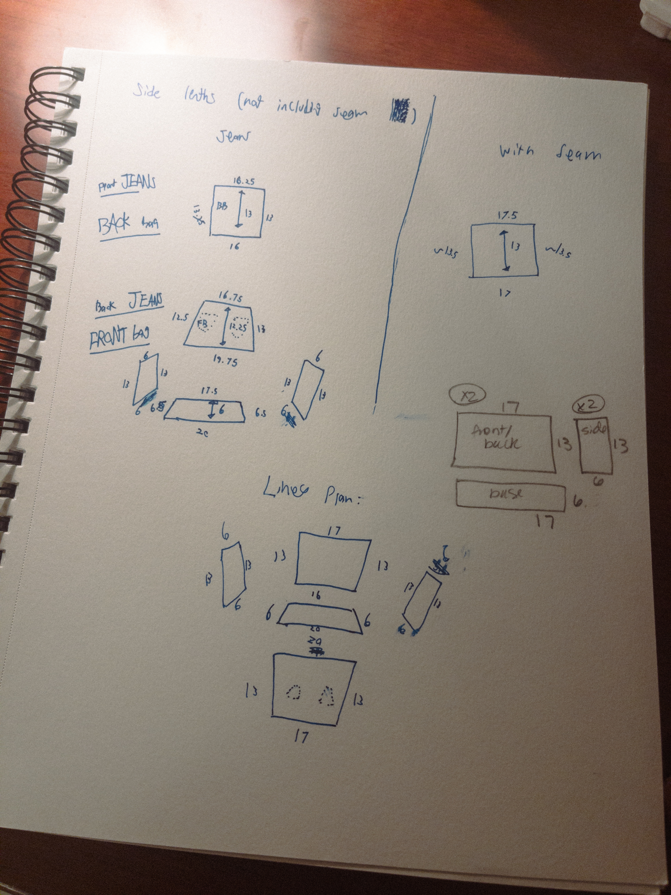
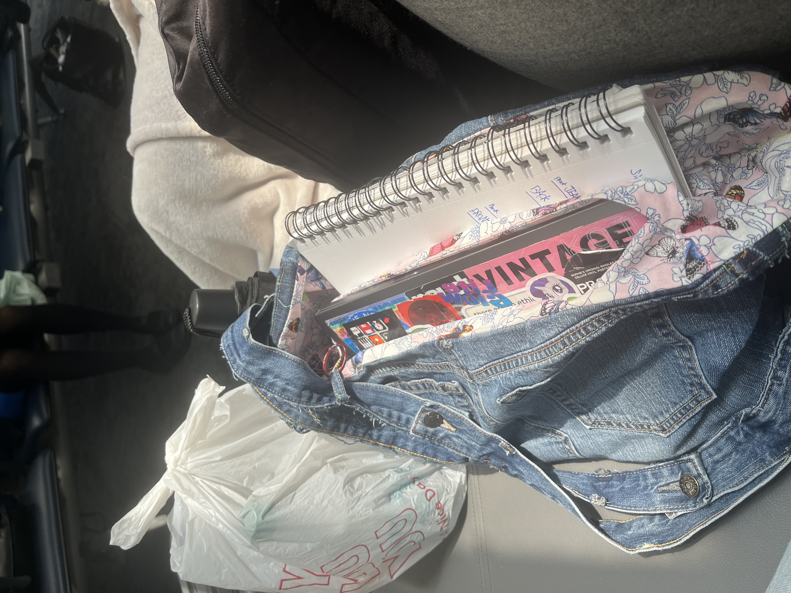

I needed a bigger bag. So I made one. Let me start from the start:

I love denim bags. I got one at Urban Outfitters last time I went to new york and found out that was exactly what I wanted. Except it wasn't - It was too small. The thing about me is I don't like taking more than one bag, and because of that I decided to solve my problem.

Making the little pattern took forever, and took a lot more tries than these few sketches. Every sketch was either too ambitious, not clear enough, or just plain and simply too boring. And to make it worse, I'm a very spontaneous person who designs less with constraints making up something but more so constraints around something previously created without such constraints. Making this was an act of discipline. 

But I also loved it. this bag meant more to me than just storage, it was a complete entry into this new world of fashion design and sewing that I had never previously thought attainable. And best of all, I was pretty descent at it. While creating this bag, and specifically while I had the sewing machine out, I also hemmed some pants which turned out very nice and clean. 

Overall, this experience allowed me to see theres more than one way to go from paper to person, and the limits that are placed on me when creating an article of clothing allows for more creative descisions that wouldn't have been possible without planning or drawing out exactly what I wanted. But in the end, I was able to realize that most of my good ideas come from a very clear thought, that gets drawn out, modified, blown up, and eventually finished into a physical concept.

